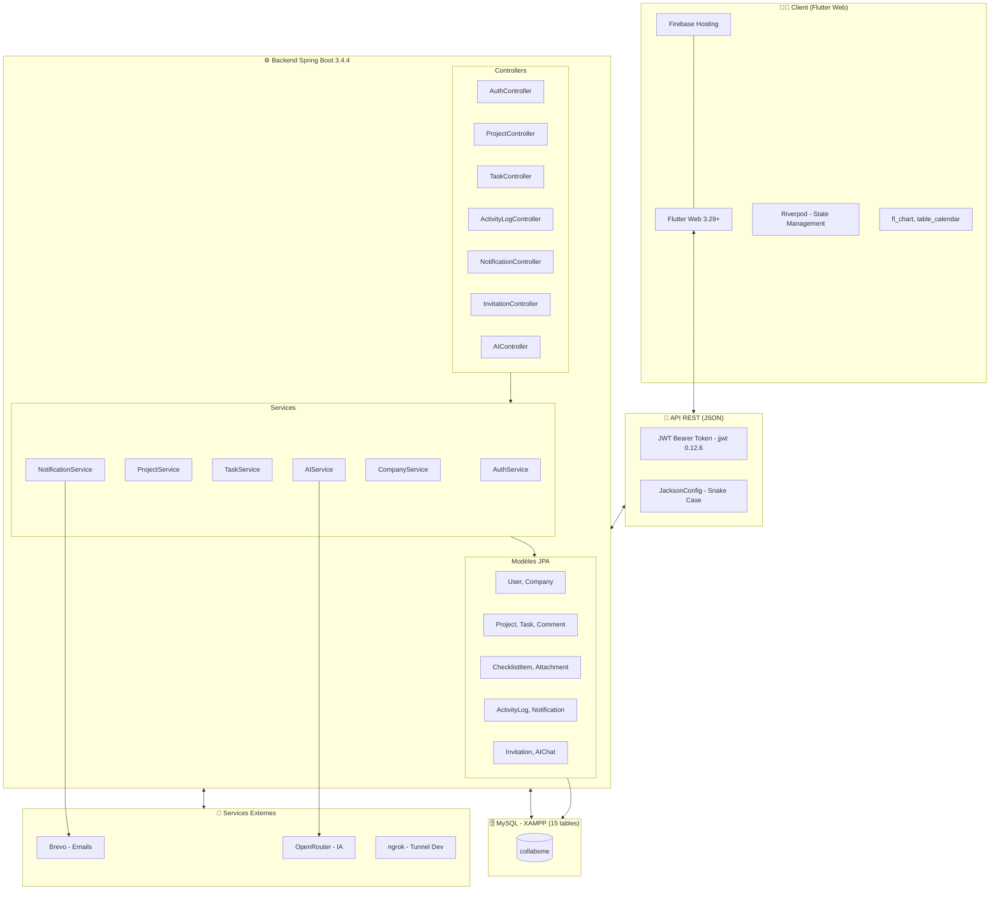

```mermaid
flowchart TB
    subgraph Client["🧑‍💻 Client (Flutter Web)"]
        direction TB
        FW[Flutter Web 3.29+]
        FH[Firebase Hosting]
        RV[Riverpod - State Management]
        FC[fl_chart, table_calendar]
    end

    subgraph API["🔌 API REST (JSON)"]
        JWT[JWT Bearer Token - jjwt 0.12.6]
        JC[JacksonConfig - Snake Case]
    end

    subgraph Backend["⚙️ Backend Spring Boot 3.4.4"]
        direction TB
        subgraph Controllers
            AC[AuthController]
            PC[ProjectController]
            TC[TaskController]
            ALC[ActivityLogController]
            NC[NotificationController]
            IC[InvitationController]
            AIC[AIController]
        end
        subgraph Services
            AS[AuthService]
            PS[ProjectService]
            TS[TaskService]
            NS[NotificationService]
            CS[CompanyService]
            AIS[AIService]
        end
        subgraph Models["Modèles JPA"]
            U[User, Company]
            P[Project, Task, Comment]
            C[ChecklistItem, Attachment]
            A[ActivityLog, Notification]
            I[Invitation, AIChat]
        end
    end

    subgraph DB["🗄️ MySQL - XAMPP (15 tables)"]
        M[(collabsme)]
    end

    subgraph External["📡 Services Externes"]
        B[Brevo - Emails]
        O[OpenRouter - IA]
        N[ngrok - Tunnel Dev]
    end

    FW <--> API
    FH --- FW
    API <--> Backend
    Backend <--> DB
    Backend <--> External
    Controllers --> Services
    Services --> Models
    Models --> DB
    NS --> B
    AIS --> O
```
