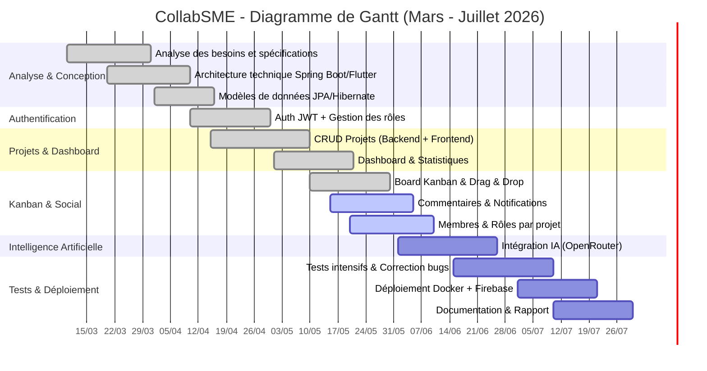

```mermaid
gantt
    title CollabSME - Diagramme de Gantt (Mars - Juillet 2026)
    dateFormat  YYYY-MM-DD
    axisFormat  %d/%m

    section Analyse & Conception
    Analyse des besoins et spécifications   :done, a1, 2026-03-10, 21d
    Architecture technique Spring Boot/Flutter :done, a2, 2026-03-20, 21d
    Modèles de données JPA/Hibernate        :done, a3, 2026-04-01, 15d

    section Authentification
    Auth JWT + Gestion des rôles            :done, b1, 2026-04-10, 20d

    section Projets & Dashboard
    CRUD Projets (Backend + Frontend)       :done, c1, 2026-04-15, 25d
    Dashboard & Statistiques                :done, c2, 2026-05-01, 20d

    section Kanban & Social
    Board Kanban & Drag & Drop              :done, d1, 2026-05-10, 20d
    Commentaires & Notifications            :active, d2, 2026-05-15, 21d
    Membres & Rôles par projet              :active, d3, 2026-05-20, 21d

    section Intelligence Artificielle
    Intégration IA (OpenRouter)             :e1, 2026-06-01, 25d

    section Tests & Déploiement
    Tests intensifs & Correction bugs       :f1, 2026-06-15, 25d
    Déploiement Docker + Firebase           :f2, 2026-07-01, 20d
    Documentation & Rapport                 :f3, 2026-07-10, 20d
```
